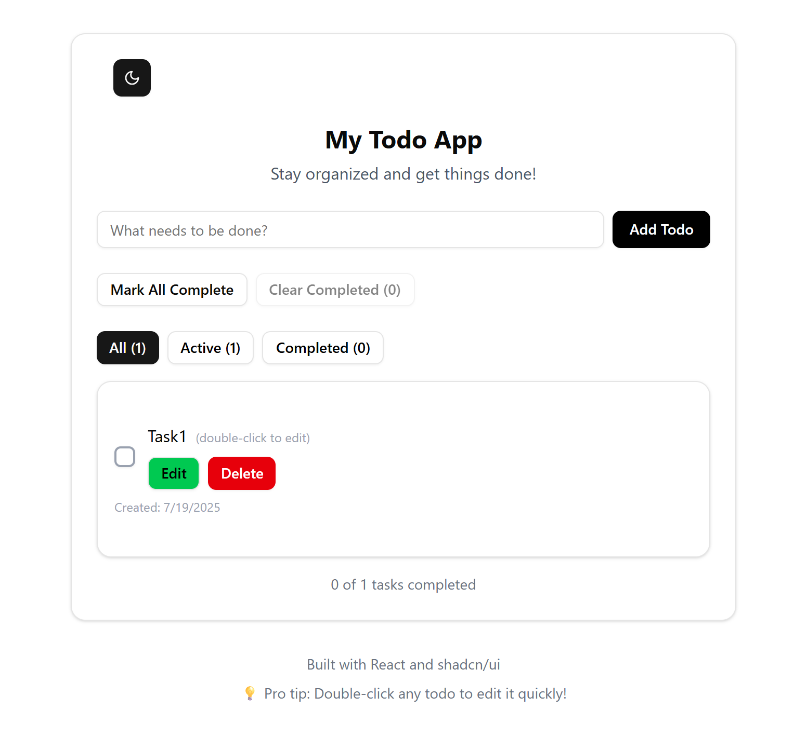
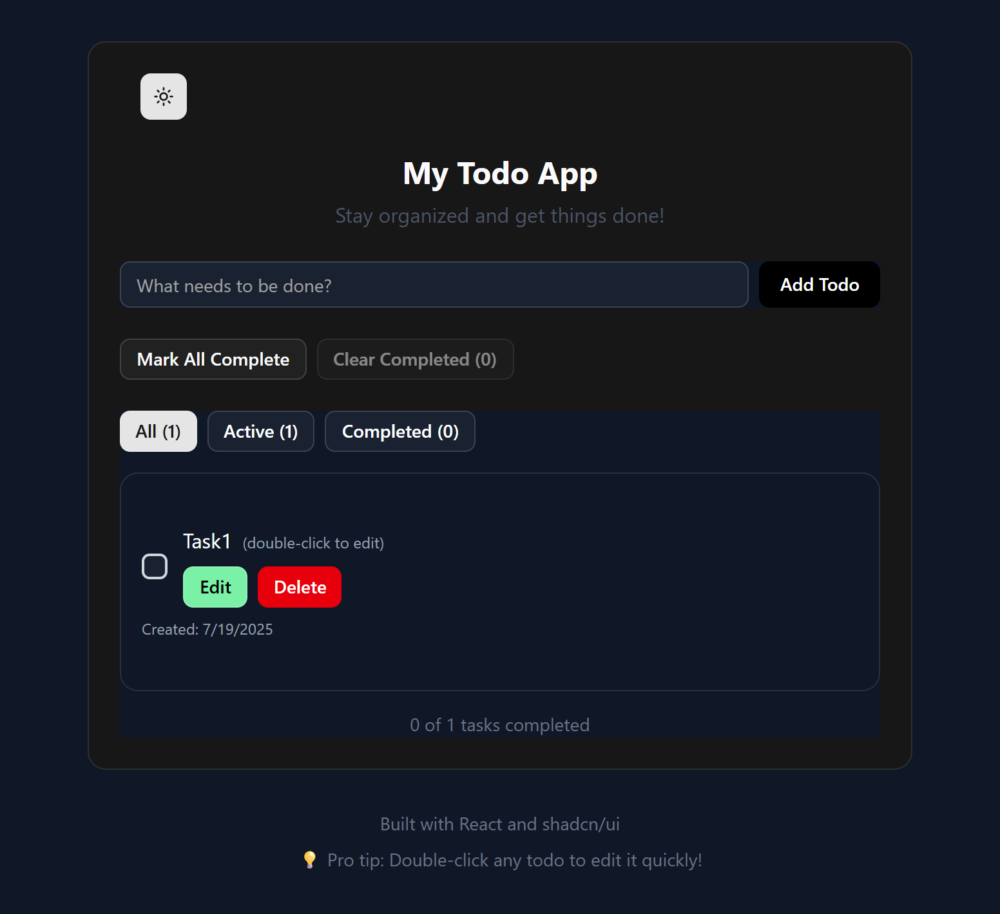

# ✅ React Todo App

A sleek, minimal, and powerful Todo app built with **React**, **shadcn/ui**, and **Tailwind CSS**. Features include CRUD, filters, localStorage persistence, and dark mode support.

[🚀 Live Demo](https://react-todo-pk.netlify.app//) &nbsp; | &nbsp; [📦 GitHub](https://github.com/karanpr01/React-Todo)

---

## 📸 Preview

  



---

## ✨ Features

- 📝 Add, edit, delete todos
- ✅ Mark as complete/incomplete
- 🔎 Filter by all / active / completed
- 🌙 Dark mode toggle
- 💾 Data persists using localStorage
- 📆 Shows creation date
- 🧪 Form validation with inline error handling
- ⚡ Fast and responsive (TailwindCSS + Radix UI)

---

## 📂 Folder Structure

```
src/
│
├── components/        # shadcn UI components
├── TodoForm/          # AddTodo form
├── TodoList/          # Todo list and items
├── Hooks/             # useTodo custom hook
├── App.jsx            # Main app component
├── index.css          # Tailwind styles
└── main.jsx           # App entry point
```

---

## 🚀 Tech Stack

- **React**
- **Tailwind CSS**
- **shadcn/ui** (Radix UI)
- **LocalStorage** (for data persistence)
- **Vite** (for fast dev server)

---

## 🛠 Setup Instructions

```bash
# 1. Clone the repo
git clone https://github.com/karanpr01/React-Todo.git
cd React-Todo

# 2. Install dependencies
npm install

# 3. Run the dev server
npm run dev
```

---

## 🎨 Customize Theme

Dark mode is powered by `Tailwind` + `localStorage`:
- Toggle with the 🌙/☀️ button in the header
- Persisted between reloads

---

## 📈 Deployment

Deployed via [Netlify](https://netlify.app/)

To deploy yourself:
1. Push this repo to GitHub
2. Link it to Netlify
3. Set build command: `npm run build`
4. Set output directory: `dist`

---

## 🤝 Contributing

Pull requests are welcome!  
If you’d like to suggest improvements or report bugs, feel free to [open an issue](https://github.com/karanpr01/React-Todo/issues).

---

## 📄 License

[MIT License](./LICENSE)

---

## 🙋‍♂️ Author

Made with ❤️ by [@karanpr01](https://github.com/karanpr01)

Connect on [LinkedIn](https://www.linkedin.com/in/prem-karn-a8707b36a)  
Follow on [Twitter](https://x.com/PremAnilkarn1)  
